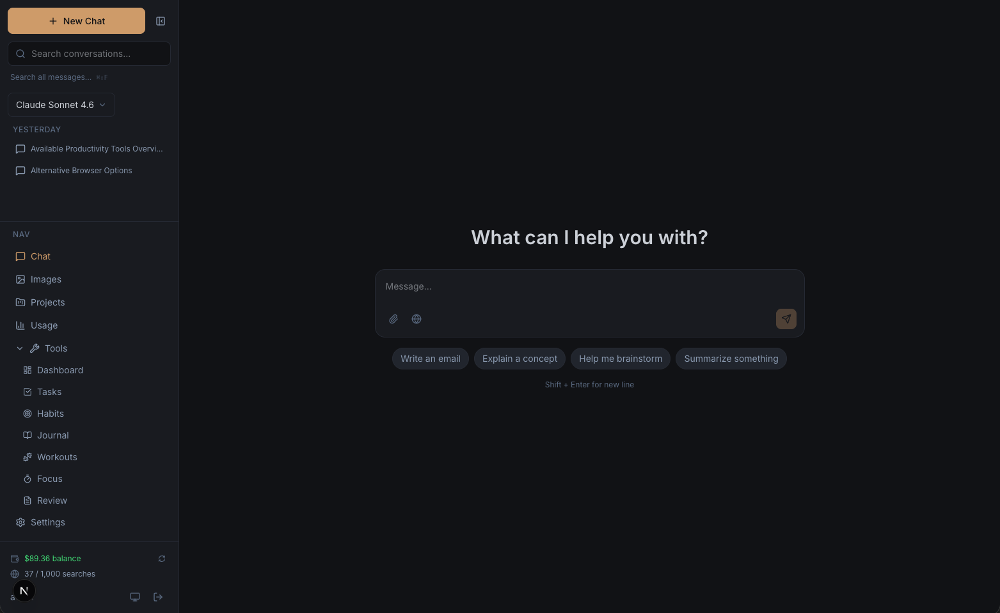
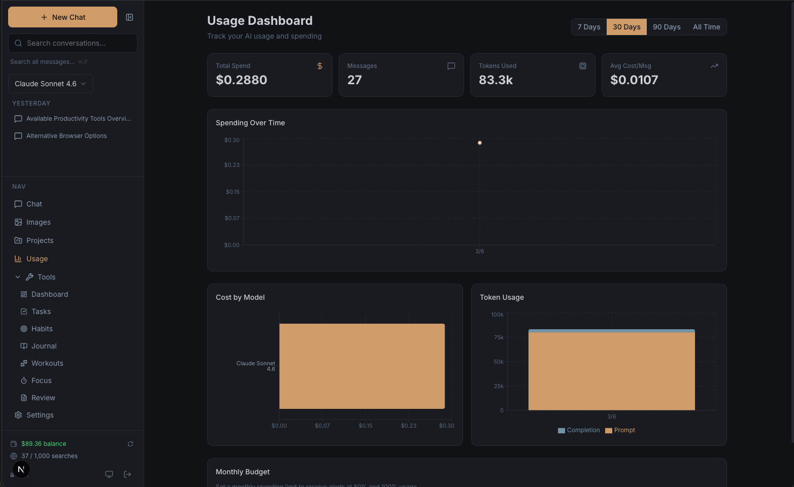

# Daily Agent

A full-stack AI personal assistant that owns your data. Multi-model chat, life management tools, and an AI layer that understands your context — because it *is* your context.

Not another chatbot wrapper. Not an automation platform that connects external APIs. One app with built-in productivity tools and an AI that knows your tasks, habits, workouts, journal, and focus patterns.

Built with Next.js 16, multi-provider AI (Anthropic, Google Gemini, OpenAI-compatible, and OpenRouter), and Supabase. Deploy on Vercel or self-host. Use your own API keys.


---

## Quick Start

### Prerequisites

- Node.js 18+
- A [Supabase](https://supabase.com) project (free tier works)
- At least one AI provider API key (Anthropic, Google, OpenAI, or OpenRouter)
- A [Tavily](https://tavily.com) API key for web search (free tier works)

### 1. Clone and install

```bash
git clone https://github.com/your-username/daily-agent.git
cd daily-agent
npm install
```

### 2. Configure environment

```bash
cp .env.example .env.local
```

Fill in the required values:

| Variable | Required | Description |
|----------|----------|-------------|
| `NEXT_PUBLIC_SUPABASE_URL` | Yes | Supabase project URL (Dashboard > Settings > API) |
| `NEXT_PUBLIC_SUPABASE_ANON_KEY` | Yes | Supabase anonymous key (Dashboard > Settings > API) |
| `SIGNUP_SECRET` | Yes | Secret code users must enter to create an account |
| `TAVILY_API_KEY` | Yes | Enables web search in chat ([get key](https://tavily.com)) |
| `TITLE_MODEL` | No | Model for auto-generating conversation titles (default: `google/gemini-3-flash-preview`) |
| `DEFAULT_CHAT_MODEL` | No | Default chat model (default: `anthropic/claude-sonnet-4.5`) |
| `DEFAULT_IMAGE_MODEL` | No | Default image model (default: `google/gemini-2.5-flash-image`) |
| `ENCRYPTION_KEY` | No | 32-byte hex string for encrypting provider API keys in the database. Auto-generated if not set, but providing a fixed value ensures keys survive server restarts. |
| `NEXT_PUBLIC_SITE_NAME` | No | App name in UI and meta tags (default: `Daily Agent`) |
| `NEXT_PUBLIC_SITE_DESCRIPTION` | No | Meta description (default: `Your AI productivity agent`) |

Provider API keys (Anthropic, Google, OpenAI, OpenRouter) are configured from the Admin panel inside the app and stored encrypted in the database — not in environment variables.

### 3. Set up the database

Open the Supabase SQL Editor and run the entire contents of:

```
supabase/migrations/schema.sql
```

This single file creates all tables, indexes, RLS policies, triggers, and storage buckets. Every table is protected by row-level security — users can only access their own data.

### 4. Create your admin account

1. Start the app (`npm run dev`)
2. Sign up using your `SIGNUP_SECRET`
3. In the Supabase SQL Editor, grant yourself admin:

```sql
UPDATE profiles SET is_admin = true WHERE email = 'your@email.com';
```

**Admin access is required to manage AI models.** Without it, the app has no models configured and chat won't work. Once you're admin:

1. Go to **Settings** in the app
2. Scroll to **Model Management**
3. Add at least one chat model (e.g., `anthropic/claude-sonnet-4.5`)
4. Set the display name, provider, pricing, and toggle "Default" on

### 5. Run

```bash
npm run dev     # Development (Turbopack)
npm run build   # Production build
npm start       # Production server
```

---

## Features

### Multi-Model AI Chat
Stream responses from any configured model — Claude, GPT, Gemini, Llama, and more — routed through native provider adapters (Anthropic, Google, OpenAI-compatible) or OpenRouter. Switch models mid-conversation. Per-message token counts and cost tracking. AI-generated conversation titles. Keyboard shortcuts for power users.

**Agent / Chat Mode Toggle** — Agent mode (default) gives the AI access to all productivity tools. Chat mode strips tools for a clean, focused conversation. Toggle per-conversation; the setting persists.



### Multi-Provider LLM Support
Native adapters for Anthropic, Google Gemini, and any OpenAI-compatible endpoint (including OpenRouter). Providers and their API keys are managed from the Admin panel. The LLM router selects the correct adapter per model at request time — no manual routing required.

### Image Generation
Generate images through configured image models. Gallery view with history.

### Web Search
Tavily-powered search with AI summarization. Toggle per-message. Configurable search depth and result count per user. Sources displayed inline with citation linking.

### Context-Aware AI
The AI sees your productivity data. Toggle context injection per user — when enabled, the AI knows your tasks, habits, streaks, and recent activity. It doesn't just answer questions, it understands your day.

- **Tool Calling** — Create tasks, log habits, start focus sessions, manage goals, and more directly from chat. 13 tools total: 7 mutation tools with an approval UI (user confirms before execution), 6 read-only tools that auto-execute.
- **Conversation Search Tool** — AI can search past conversations via tool call using Postgres full-text search. Available in both agent and chat modes.
- **Memory Notes** — User-defined "About Me" notes in Settings, injected into the system prompt in every mode.
- **Morning Briefing** — AI-generated daily summary on the dashboard. "Plan my day" link. Cached per day, regenerate on demand.
- **Proactive Insights** — Cross-tool pattern analysis with dismissable insight cards (encouragement, warnings, suggestions).
- **In-Tool AI Assist** — Journal reflection, habit coaching, workout suggestions, task breakdown, enhanced weekly review.

### Life Management Tools

**Task Manager** — Franklin Covey A/B/C priority system. Drag-and-drop reorder within priority groups. Daily rollover for incomplete tasks. Recurrence (daily/weekly/monthly). Project linking.


**Habit Tracker** — Weekly grid view. Streak tracking with sparkline charts. Completion rate badges. Expandable 30-day heatmap per habit. Target days configuration.


**Workout Logger** — Reusable workout templates with exercises. Active workout logger with set tracking (weight/reps). Stats: total volume, personal records, weekly averages.


**Journal** — Auto-saving editor. Mood tracking (1-5). AI writing prompts. Full-text search across all entries.


**Goals** — Set goals and link them to tasks and habits. Track progress over time. The AI uses your goals to prioritize briefings and insights.

**Focus Timer** — Pomodoro timer with circular progress display. Task linking. 7-day bar chart. Top tasks by focus time.


**Dashboard** — Aggregated daily snapshot across all tools. Widget links to each tool. Morning briefing and insight cards.

**Weekly Review** — AI-generated summaries of your week. Collapsible sections by heading. Stats header bar.

### Usage & Budget Tracking
Per-message token counts and cost. Usage dashboard with spending charts (daily/weekly/monthly), per-model cost breakdown, most-used models. Configurable monthly budget with 80%/100% warning alerts.



### Calendar View
Monthly calendar with activity dots showing tasks, habits, journal entries, workouts, and focus sessions per day. Click any day for a detail panel with a full breakdown.

### Chat History
Dedicated history page with search, infinite scroll, and bulk delete. Accessible from mobile bottom navigation and settings.

### Admin Panel
Admin-only settings page for managing providers, models, and users.

- **Provider Management** — Add API keys for Anthropic, Google, OpenAI, and OpenRouter. Keys are encrypted at rest (AES-256-GCM). Test provider connectivity from the UI.
- **Model Management** — Add, remove, and reorder models. Set display name, provider, pricing, and default status.
- **Usage Limits** — Set per-user monthly budget caps and daily conversation limits. Configurable warning thresholds.
- **Admin Usage Overview** — Aggregate usage and cost breakdown across all users.

### Conversation Search
Full-text search across all messages (not just titles). Filter by date range, model, project, and tags. Highlighted match snippets with links to the source conversation. The AI can also trigger conversation search directly via tool call.

### Projects & Organization
- Projects with system prompts, status tracking, and progress
- Per-conversation system prompt override (hierarchy: Project > Conversation > Profile > Default)
- Conversation tags with inline creation and sidebar filtering
- Conversation export (Markdown/JSON)

### Settings & Customization
- Light / dark / system theme with CSS variable theming
- Custom system prompt per user (overrides default conversational prompt)
- Memory notes ("About Me") injected into every session
- Agent / chat mode toggle per conversation
- Per-task AI model routing (fast model for quick tasks, capable model for deep analysis)
- Web search model and result count configuration
- Feature toggles: context injection, tool calling (independent controls)
- Admin panel: provider management, model management, usage limits, usage overview
- Remember email on login (localStorage)

### PWA
Installable as a Progressive Web App. Offline-first caching for static assets, network-first for API calls. Works on iOS, Android, and desktop. Mobile uses dedicated bottom navigation bar with safe area insets.

---

## Customization

### Branding

Set `NEXT_PUBLIC_SITE_NAME` in your `.env.local` to change the app name everywhere. Replace icons in `/public/` to rebrand:

- `icon-192.png` / `icon-512.png` — App icons
- `apple-touch-icon.png` — iOS home screen icon
- `icon-maskable-512.png` — Android adaptive icon
- Update `manifest.json` with your app name and colors

### Models

Models are managed from the Settings page (admin only). No hardcoded model lists. Add any model available on OpenRouter — set display name, provider, pricing, and sort order.

### System Prompt

Three levels of system prompt customization (each overrides the previous):
1. **Default** — Built-in conversational prompt (always active as fallback)
2. **Profile** — User-level override in Settings
3. **Conversation** — Per-conversation override
4. **Project** — Project-level context prepended to any active prompt

### Theme

Light, dark, and system themes. Colors defined via CSS variables in `globals.css`. Accent color: warm amber (`#d4a574` dark / `#b8845a` light).

---

## Tech Stack

| Layer | Technology |
|-------|-----------|
| Framework | Next.js 16 (App Router, Turbopack) |
| UI | React 19, Tailwind CSS 4, Lucide icons |
| Language | TypeScript 5 (strict mode) |
| Database | Supabase (PostgreSQL + Auth + RLS) |
| AI | Multi-provider LLM (Anthropic SDK, Google AI, OpenAI-compatible), function calling |
| Search | Tavily API |
| Rendering | react-markdown, rehype-highlight, remark-gfm |
| PWA | Service worker + Web App Manifest |
| Testing | Vitest + React Testing Library |

---

## Architecture

```
src/
  app/
    (auth)/              # Login, signup (public routes)
    (protected)/         # All authenticated pages
      chat/              # Multi-model AI chat
      dashboard/         # Daily snapshot + briefing + insights
      tasks/             # Franklin Covey task manager
      habits/            # Habit tracker with streaks
      workouts/          # Workout templates + logger
      journal/           # Journal with mood tracking
      focus/             # Pomodoro focus timer
      review/            # AI weekly review
      calendar/          # Monthly calendar with activity view
      history/           # Chat history with search + bulk delete
      projects/          # Project management
      usage/             # Usage & budget dashboard
      admin/             # Admin panel (providers, limits, usage overview)
      image/             # Image generation
      settings/          # User & admin settings
    api/
      chat/              # Streaming chat
        tool-execute/    # Tool execution endpoint
      ai-assist/         # In-tool AI suggestions
      briefing/          # Morning briefing generation
      insights/          # Proactive insight analysis
      conversations/     # Conversation CRUD
      messages/          # Full-text message search + partial save
      tasks/             # Task CRUD + rollover + reorder
      habits/            # Habit CRUD + log toggle + streaks
      journal/           # Journal CRUD + search + AI prompts
      workouts/          # Templates + logs + exercises + stats
      focus/             # Focus session CRUD + stats
      dashboard/         # Aggregated daily snapshot
      weekly-review/     # Review CRUD + AI generation
      calendar/          # Calendar day detail + monthly aggregation
      usage/             # Usage aggregation + budget
      models/            # Model list (public) + admin CRUD
      profile/           # User settings
      projects/          # Project CRUD
      tags/              # Tag management
      search/            # Conversation search
      image/             # Image generation
      images/            # Image storage/retrieval
      web-search/        # Tavily web search
      auth/              # Auth callback
      admin/             # Admin: settings, providers, limits, usage
  components/
    layout/              # Sidebar, ProtectedLayoutClient, BottomNav
    shared/              # DateNavigation, StatCard, EmptyState, SparklineChart, FormModal
    dashboard/           # Dashboard + widgets + MorningBriefing + InsightCards
    tasks/               # TaskList, TaskItem, TaskFormModal, TaskRolloverBanner
    habits/              # HabitTracker, HabitRow, HabitFormModal
    workouts/            # WorkoutDashboard, WorkoutLogger, WorkoutStats, TemplateFormModal
    journal/             # JournalView, JournalEditor, JournalEntryCard
    focus/               # FocusTimer, TimerDisplay
    review/              # WeeklyReview
    calendar/            # CalendarView, CalendarGrid, CalendarDayCell, DayDetailPanel
    history/             # ChatHistory (search, bulk delete, infinite scroll)
    usage/               # UsageDashboard, BudgetSettings
    search/              # SearchModal, SearchResult
    projects/            # Project management components
    auth/                # AuthForm (login, signup, remember email)
    Chat.tsx             # Main chat interface
    Message.tsx          # Message rendering (markdown, syntax highlighting, citations)
    ModelSelector.tsx    # Model selection popover
    ImageGenerator.tsx   # Image generation interface
    ToolCallCard.tsx     # Tool call approval UI
  lib/
    supabase/            # Server and client Supabase instances
    llm/                 # Multi-provider LLM abstraction layer
      router.ts          # Selects adapter per model
      types.ts           # Shared LLM types
      adapters/          # anthropic.ts, google.ts, openai-compatible.ts
    tools/               # Tool definitions + executor
    ai-models.ts         # Per-task model routing
    app-config.ts        # App-level configuration
    encryption.ts        # AES-256-GCM encryption for provider keys
    rate-limit.ts        # Request rate limiting
    usage-limits.ts      # Per-user budget and conversation limits
    admin.ts             # Admin auth helpers
    enhanced-search.ts   # AI-summarized web search
    productivity-context.ts  # Context injection data aggregation
    cost.ts              # Token cost calculation
    system-prompt.ts     # Default conversational system prompt
    dates.ts             # Date utility functions
    theme.tsx            # ThemeProvider (light/dark/system)
    tavily.ts            # Tavily search client
    retry.ts             # Retry utility
  types/
    database.ts          # TypeScript types for all Supabase tables
supabase/
  migrations/
    schema.sql           # Complete database schema (single file)
```

### Data Flow

1. Client components send requests to API routes
2. API routes verify auth via Supabase server client (every route is protected)
3. Rate limiter and usage-limit checks run before any AI request
4. Chat streams through the LLM router, which dispatches to the appropriate provider adapter (Anthropic, Google, OpenAI-compatible, or OpenRouter)
5. Tool calls go through an approval workflow — mutations require user confirmation, reads auto-execute
6. Context injection aggregates productivity data into the system prompt (when enabled)
7. All messages persist with token counts and cost for usage tracking
8. RLS policies enforce data isolation — users only see their own data

---

## Database

Single schema file (`supabase/migrations/schema.sql`) covering:

- **Core**: profiles, conversations, messages, generated_images
- **Models**: app_models with admin management, pricing, sort order
- **Projects**: projects, tags, conversation_tags
- **Tools**: tasks, habits, habit_logs, journal_entries, workout_templates, workout_exercises, workout_logs, workout_log_exercises, focus_sessions, goals, weekly_reviews
- **AI**: daily_briefings, insight_cache, ai_model_config, ai_feature_toggles
- **Admin**: usage_limits (per-user budget and conversation caps)
- **Search**: full-text search indexes on messages and journal entries
- **Usage**: budget configuration per user

Every table has row-level security enabled. Users can only access their own data.

---

## Troubleshooting

**Chat shows "No models available"**
You need to add models as an admin. See step 4 in Quick Start. Make sure you've run the `UPDATE profiles SET is_admin = true` query and refreshed the page.

**Supabase RLS errors (403 / "new row violates row-level security")**
Make sure you ran the full `schema.sql` file — it includes all RLS policies. If you only ran part of it, re-run the entire file. Supabase will skip objects that already exist.

**Provider returns 401 or 403**
The API key for that provider is missing or invalid. Go to the Admin panel and verify the key is saved correctly. Make sure there are no trailing spaces. You can use the "Test" button next to each provider to verify connectivity.

**Web search toggle doesn't appear**
`TAVILY_API_KEY` is not set in `.env.local`. Add it and restart the dev server.

**"Module not found" or build errors after pulling updates**
Run `npm install` again — dependencies may have changed.

**PWA not updating**
The service worker caches aggressively. Hard refresh (`Cmd+Shift+R` / `Ctrl+Shift+R`) or clear the service worker in DevTools > Application > Service Workers.

---

## Commands

```bash
npm run dev      # Start dev server (Turbopack)
npm run build    # Production build
npm start        # Start production server
npm run lint     # Run ESLint

npm test             # Run all tests once
npm run test:watch   # Watch mode
npm run test:coverage # Coverage report
```

---

## Documentation

- **[Setup Guide](docs/SETUP.md)** — Detailed deployment walkthrough: Supabase, Vercel, first-run config, model recommendations
- **[Admin Guide](docs/ADMIN.md)** — Provider management, model configuration, usage limits, user management
- **[User Guide](docs/USER.md)** — Chat, agent mode, productivity tools, AI features, settings
- **[Customization Guide](docs/CUSTOMIZATION.md)** — Branding, theming, system prompts, adding tools, extending the app

---

## License

Personal use license. You may use, modify, and deploy this software for yourself or your business. You may not resell or redistribute the source code.
