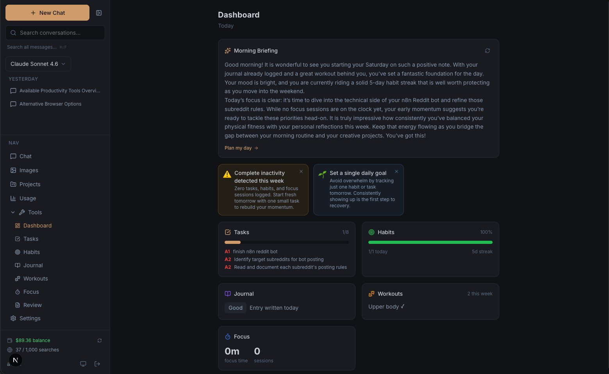
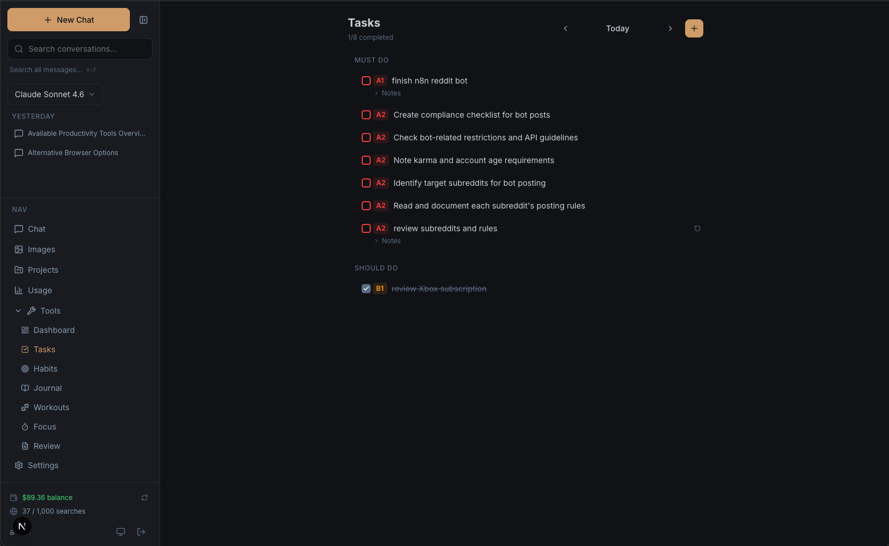
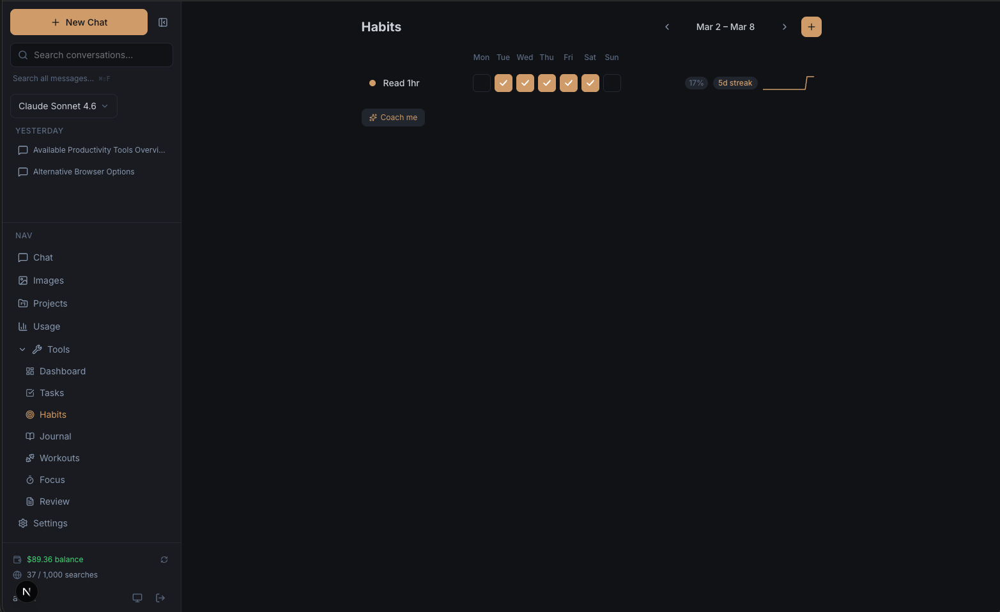
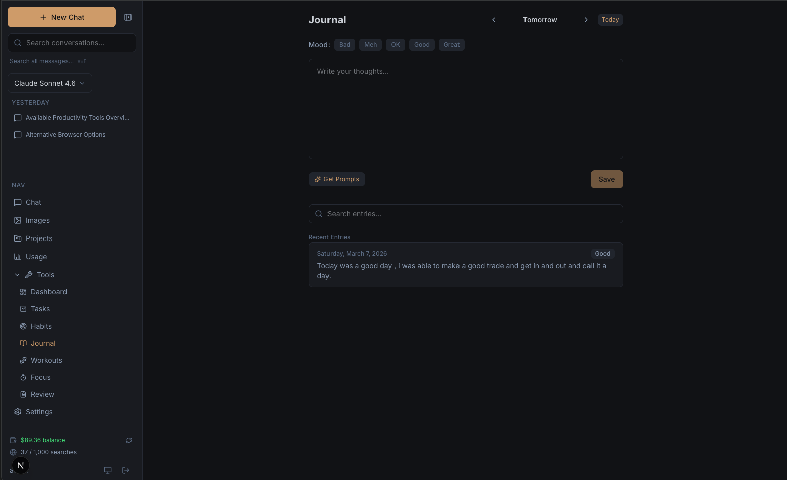
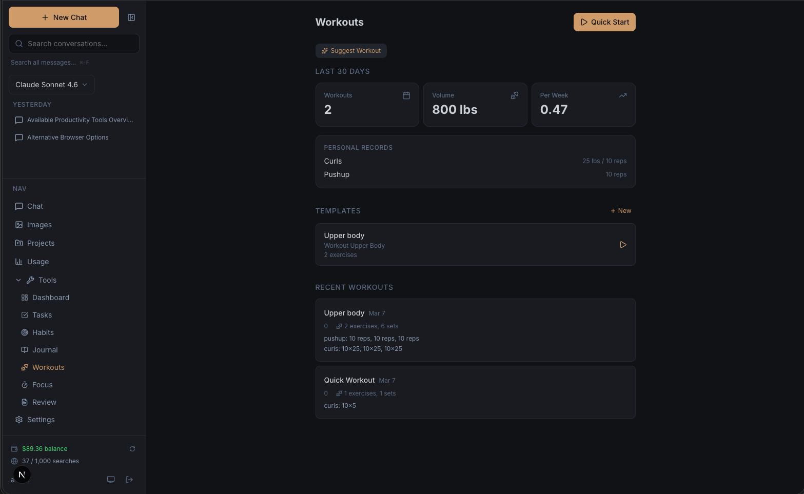
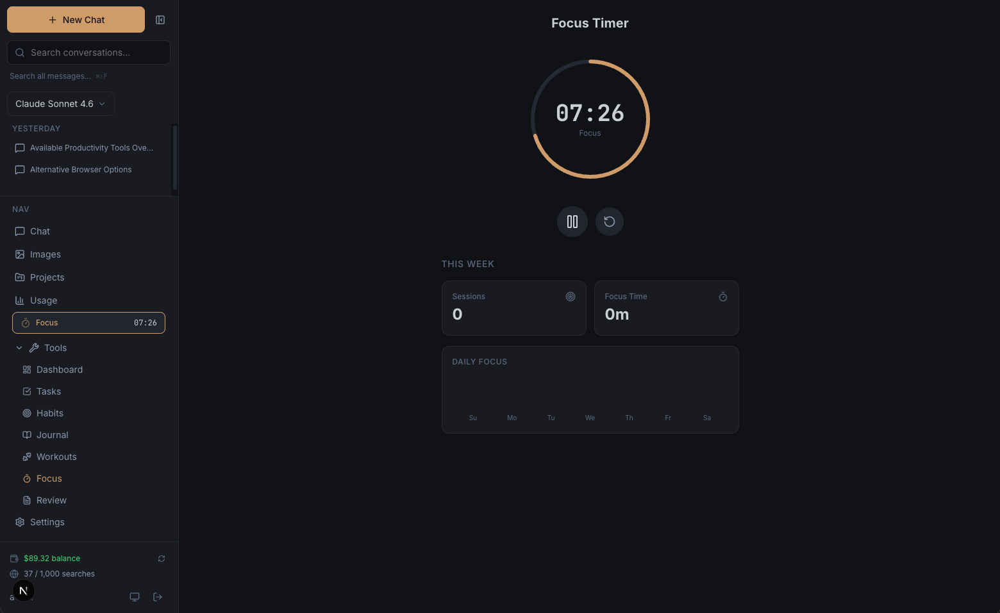

# Daily Agent MCP

> 📖 **Full documentation:** <https://dailyagent.dev/>

**Hardened productivity data layer for [OpenClaw](https://openclaw.ai).** Postgres behind a typed MCP interface, plus a Next.js dashboard that reads and edits the same database. Self-hosted, single-user, Tailscale-gated.

Not a chatbot. Not an AI product. Just a durable store for tasks, habits, journal, workouts, focus sessions, goals, and spaces — exposed to your agent over MCP and to your browser over HTTP.

---

## What this is

Two front doors, one database:

1. **MCP server** (`/api/mcp`) — the primary interface. Your OpenClaw agent reads and writes every piece of productivity data through it: 34 typed tools, a dozen prompt templates, a handful of read-only resources. Authenticated by a single bearer token.
2. **Dashboard** (`/dashboard`, `/tasks`, `/habits`, `/journal`, `/workouts`, `/focus`, `/goals`, `/calendar`, `/review`, `/spaces`, `/settings`) — a Next.js UI for browsing and manually editing the same data. No AI features. No generate buttons. If you want AI, you talk to OpenClaw.

OpenClaw owns everything about the agent: model choice, scheduling, message delivery (Telegram / WhatsApp / etc.), briefings, insights, reviews. This repo owns storage and the contract.



---

## Quick start

For the full walkthrough (Docker Compose + Tailscale + OpenClaw hookup on a VPS) see **[docs/DEPLOY.md](docs/DEPLOY.md)**. The short version:

```bash
git clone https://github.com/WalrusQuant/mcp-dailyagent.git
cd mcp-dailyagent

# Write .env with DATABASE_URL, SELF_HOSTED_USER_ID, MCP_API_KEY
# (see DEPLOY.md for secret generation)

docker compose up -d postgres
docker compose run --rm app node node_modules/drizzle-kit/bin.cjs migrate
docker compose up -d --build app
```

Then bring your VPS onto Tailscale and firewall port 3000 off the public internet.

### OpenClaw connection

Point an MCP server entry at `http://<vps-tailnet-host>:3000/api/mcp` with `Authorization: Bearer <MCP_API_KEY>`. Install the skill file (**[docs/openclaw-skill.md](docs/openclaw-skill.md)**) into OpenClaw's skills directory so the agent knows how to use the tools.

### Local development

```bash
# .env.local with DATABASE_URL, SELF_HOSTED_USER_ID, MCP_API_KEY
npm install
npm run db:migrate
npm run dev
```

Dashboard at <http://localhost:3000>. MCP at <http://localhost:3000/api/mcp>.

---

## Data model

17 tables, one user. Schema lives in `src/lib/db/schema.ts` (Drizzle); migrations in `drizzle/`.

- **profiles** — the single user's profile
- **spaces** — areas of life / projects that group tasks, habits, goals
- **tags** — user-defined tags
- **tasks** — Franklin Covey A1-C9 priority, recurrence, rollover, space + goal linking
- **habits**, **habit_logs** — with ISO target days and streak tracking
- **journal_entries** — mood 1-5, full-text search
- **workout_templates**, **workout_exercises**, **workout_logs**, **workout_log_exercises** — strength / timed / cardio
- **focus_sessions** — Pomodoro timer sessions, optionally linked to a task
- **goals**, **goal_progress_logs** — category, progress %, target date
- **weekly_reviews** — written by dashboard or by OpenClaw via `save_weekly_review`
- **daily_briefings** — written by OpenClaw via `save_daily_briefing`, displayed read-only in the dashboard
- **insight_cache** — written by OpenClaw via `save_insights`, displayed as insight cards on the dashboard

Every write tool's input schema matches the DB's CHECK constraints (priority `^[A-C][1-9]$`, habit frequency `daily|weekly`, goal category one of seven values, etc.) — no silent rejections from the database.

---

## MCP surface

Full tool reference lives in **[docs/openclaw-skill.md](docs/openclaw-skill.md)**. Summary:

| Domain | Tools |
|---|---|
| **Tasks** | `list_tasks`, `create_task`, `update_task`, `complete_task`, `delete_task` |
| **Habits** | `list_habits`, `get_habit_stats`, `create_habit`, `toggle_habit` |
| **Journal** | `get_journal_entries`, `search_journal`, `create_journal_entry` |
| **Workouts** | `list_workout_logs`, `list_workout_templates`, `log_workout` |
| **Focus** | `get_focus_sessions`, `get_focus_stats`, `start_focus_session`, `complete_focus_session` |
| **Goals** | `list_goals`, `create_goal`, `update_goal`, `log_goal_progress` |
| **Spaces** | `list_spaces`, `create_space`, `update_space` |
| **Weekly reviews** | `get_weekly_review`, `save_weekly_review` |
| **Daily briefings** | `get_daily_briefing`, `save_daily_briefing` |
| **Insights** | `get_insights`, `save_insights` |
| **Calendar** | `get_day_summary`, `get_week_summary` |

**Prompts** (loadable templates OpenClaw fills with data and generates against): `daily_planning`, `morning_briefing`, `end_of_day_review`, `weekly_review`, `weekly_trends`, `productivity_report`, `habit_analysis`, `goal_check_in`, `goal_planning`, `space_planning`, `week_planning`, `journal_prompt`, `workout_suggestion`.

**Resources** (read-only URIs): `dailyagent://dashboard`, `dailyagent://tasks/today`, `dailyagent://tasks/overdue`, `dailyagent://habits/today`, `dailyagent://journal/recent`, `dailyagent://goals/active`, and more.

Transport: Streamable HTTP, stateless, `Authorization: Bearer <MCP_API_KEY>` per request.

---

## Dashboard

A plain viewer + manual editor. Access is gated by Tailscale — no login, no passwords, no app-level auth. If you can reach the URL, you're in.

- **Dashboard** — daily snapshot: tasks, habits, journal, workouts, focus, goals, with read-only briefing and insight cards written by OpenClaw
- **Tasks** — Franklin Covey priorities, drag-to-reorder, rollover of incomplete tasks, space/goal linking, recurrence
- **Habits** — weekly grid, streaks, 30-day heatmap
- **Journal** — auto-saving editor, mood 1-5, full-text search
- **Workouts** — templates, active logger, stats
- **Focus** — Pomodoro timer with task linking
- **Goals** — progress, categories, target dates
- **Spaces** — group tasks/habits/goals (projects/areas of life)
- **Calendar** — monthly view with per-day detail panels
- **Review** — read or write the weekly review (content can also be written by OpenClaw)
- **Settings** — theme, and a Danger Zone "Wipe All Data" with type-to-confirm







---

## Tech stack

| Layer | Tech |
|---|---|
| Framework | Next.js 16 (App Router, Turbopack, standalone output) |
| UI | React 19, Tailwind CSS 4, Lucide icons |
| Language | TypeScript 5 (strict) |
| Database | Postgres 16 (self-hosted) |
| ORM | Drizzle ORM + `postgres` (postgres.js) |
| MCP | `@modelcontextprotocol/sdk` over Streamable HTTP |
| Access | Tailscale (network layer) + bearer token (MCP) |
| Deploy | Docker + Docker Compose |
| Testing | Vitest + React Testing Library |
| PWA | Web App Manifest + service worker |

---

## Architecture

```
src/
  app/
    (protected)/          # Dashboard pages — no auth middleware, Tailscale gates access
      dashboard/          # Daily snapshot
      tasks/ habits/ journal/ workouts/ focus/ goals/
      spaces/             # Areas of life / projects
      calendar/ review/ settings/
    api/
      mcp/                # THE MCP server endpoint (Streamable HTTP, Bearer auth)
      tasks/ habits/ journal/ workouts/ focus/ goals/
      spaces/ tags/ calendar/ dashboard/
      briefing/ insights/ # GET-only — reads what OpenClaw saved
      weekly-review/      # CRUD, no AI
      profile/            # Single user's profile
      wipe-data/          # Danger Zone
  lib/
    db/
      client.ts           # Lazy-proxy Drizzle instance
      schema.ts           # All 17 tables + CHECK constraints
    mcp/
      server.ts           # Factory: registers tools, prompts, resources
      auth.ts             # Bearer token validation
      tools/              # 34 tools, one file per domain
      prompts/            # 13 prompt templates
      resources/          # Read-only URI resources
      queries/            # Shared query helpers
    auth.ts               # getUserId() reading SELF_HOSTED_USER_ID
    oauth-scopes.ts       # Scope list + "all" expansion
    dates.ts theme.tsx retry.ts
  components/
    layout/ shared/ dashboard/ tasks/ habits/ journal/
    workouts/ focus/ goals/ calendar/ review/ spaces/ settings/
drizzle/                  # Migration SQL, generated from schema.ts
docker-compose.yml        # Postgres + app, bound to 127.0.0.1
Dockerfile                # Multi-stage (deps → builder → runner), Next.js standalone
docs/
  DEPLOY.md               # Full VPS walkthrough
  openclaw-skill.md       # Skill file for OpenClaw
```

### Data flow

1. **OpenClaw → MCP.** Agent hits `/api/mcp` with the bearer token; reads and writes land in Postgres through Drizzle.
2. **Browser → dashboard pages → API routes → Drizzle → Postgres.** Plain CRUD. No AI.
3. **OpenClaw writes, dashboard reads.** `daily_briefings`, `weekly_reviews`, `insight_cache` are populated by the agent via `save_*` tools and rendered read-only in dashboard widgets.
4. **Same DB, two interfaces, last-write-wins.**

---

## Environment variables

Required (in `.env` for Docker, `.env.local` for `npm run dev`):

| Variable | Purpose |
|---|---|
| `DATABASE_URL` | Postgres connection string |
| `SELF_HOSTED_USER_ID` | UUID for the one user; must exist as a row in `profiles` |
| `MCP_API_KEY` | Bearer token OpenClaw sends on every MCP request |

Optional:

| Variable | Purpose |
|---|---|
| `NEXT_PUBLIC_SITE_NAME`, `NEXT_PUBLIC_SITE_DESCRIPTION` | Branding |
| `POSTGRES_USER`, `POSTGRES_PASSWORD`, `POSTGRES_DB` | Only used by the `postgres` compose service |

---

## Commands

```bash
npm run dev          # Dev server (Turbopack)
npm run build        # Production build
npm start            # Start production server
npm run lint         # ESLint
npm test             # Vitest once
npm run test:watch   # Vitest watch

npm run db:generate  # Generate Drizzle migration from schema diff
npm run db:migrate   # Apply migrations
npm run db:push      # Push schema directly (dev only)
npm run db:studio    # Drizzle Studio UI
```

---

## Updating a running VPS

```bash
cd mcp-dailyagent
git pull
docker compose run --rm app node node_modules/drizzle-kit/bin.cjs migrate
docker compose up -d --build app
```

---

## Documentation

- **[docs/DEPLOY.md](docs/DEPLOY.md)** — VPS deploy walkthrough (Docker + Compose + Tailscale + OpenClaw wiring)
- **[docs/openclaw-skill.md](docs/openclaw-skill.md)** — Skill file for OpenClaw: full tool, prompt, and resource reference plus usage patterns
- **[CLAUDE.md](CLAUDE.md)** — Contributor guide for Claude Code agents working in this repo

---

## License

AGPL-3.0. See [LICENSE](LICENSE).
