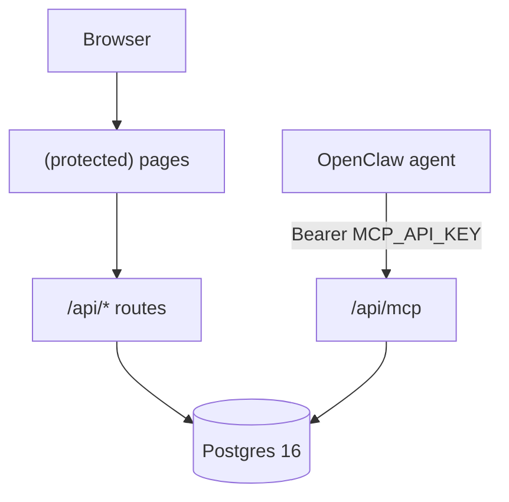
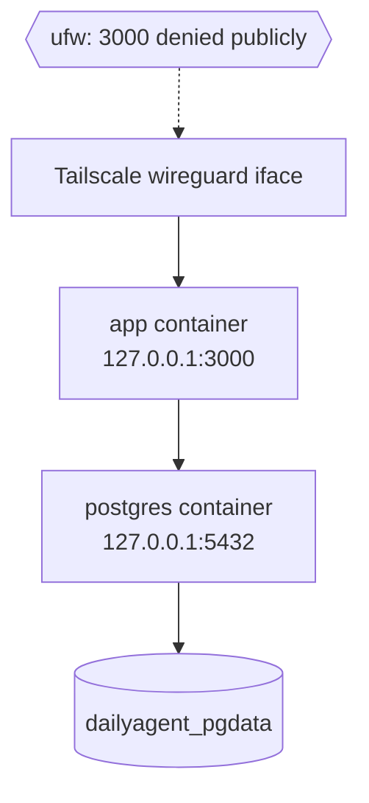

# Architecture

## The shape

Two front doors, one database, no app-level auth.



- **Network access** is gated by Tailscale. The VPS's public port 3000 is firewalled shut. The only way to reach the app is via its tailnet address.
- **MCP writes** are gated by a single bearer token (`MCP_API_KEY`) checked on every request.
- **Dashboard writes** aren't gated at all — if you can reach the URL, you're in. Tailscale *is* the auth layer.

## Request flow

### Agent call → MCP tool

1. OpenClaw sends a JSON-RPC request to `POST /api/mcp` with `Authorization: Bearer <MCP_API_KEY>`.
2. `src/lib/mcp/auth.ts` validates the bearer token against `MCP_API_KEY`. On match, it attaches the `SELF_HOSTED_USER_ID` and a full scope set to the request context.
3. The MCP SDK routes the call to the matching tool in `src/lib/mcp/tools/*.ts`.
4. The tool's Zod schema validates the arguments — this is the **first** place invalid input gets caught (priority format, enums, YYYY-MM-DD dates).
5. The tool calls Drizzle against `src/lib/db/client.ts`. Postgres CHECK constraints are the **second** (and final) line of defense.
6. Result serialized back as JSON-RPC response.

Validation happens in two places on purpose: the tool's Zod schema so the agent gets a clear error message at the transport layer, and the DB's CHECK constraint so no bad data ever persists regardless of how it arrived. Both layers match the same rules — kept in sync via `src/lib/mcp/tools/validators.ts`.

### Browser → dashboard page → API route

1. Browser loads a page under `src/app/(protected)/...`. No auth middleware runs — Tailscale is the gate.
2. Page components fetch data from `/api/*` routes under `src/app/api/*`.
3. API routes call `getUserId()` from `src/lib/auth.ts`, which returns `process.env.SELF_HOSTED_USER_ID`. That's it. No session, no cookies, no JWT.
4. Drizzle query scoped by `userId`, result returned as JSON.

## Two-write, one-read pattern (briefings, insights, reviews)

Three tables are written by OpenClaw but only *read* by the dashboard:

- `daily_briefings` — populated via `save_daily_briefing` MCP tool
- `insight_cache` — populated via `save_insights` MCP tool
- `weekly_reviews` — populated via `save_weekly_review` MCP tool

The dashboard's `/api/briefing`, `/api/insights`, and `/api/weekly-review` routes are **GET-only**. Generation is OpenClaw's job. The dashboard just shows whatever the agent last saved.

This is the key architectural rule: **no AI in this repo**. If the dashboard starts rendering something interesting, it's because OpenClaw wrote it into Postgres via an MCP tool.

## Data model

17 tables. Schema in `src/lib/db/schema.ts` (Drizzle). Migrations in `drizzle/`.

| Table | What's in it |
|---|---|
| `profiles` | The single user's profile. Must contain the row whose `id` matches `SELF_HOSTED_USER_ID`. |
| `spaces` | Areas of life / projects (`active` / `paused` / `completed`). |
| `tags` | User-defined tags. |
| `tasks` | Franklin Covey priority `A1`-`C9`, rollover, recurrence, space + goal linking. |
| `habits`, `habit_logs` | Daily/weekly habits with ISO target days (1=Mon, 7=Sun), streak via logs. |
| `journal_entries` | Mood 1-5, full-text index for search. |
| `workout_templates`, `workout_exercises`, `workout_logs`, `workout_log_exercises` | Templates and logged workouts; per-exercise `strength` / `timed` / `cardio`. |
| `focus_sessions` | Pomodoro sessions (`active` / `completed` / `cancelled`). |
| `goals`, `goal_progress_logs` | Goals with category, progress %, target date. |
| `weekly_reviews` | Weekly review content written by OpenClaw. |
| `daily_briefings` | OpenClaw-generated briefings. |
| `insight_cache` | OpenClaw-generated insight cards. |

Every table with a domain enum has a matching `CHECK` constraint. Every date field is a proper `date` column. Every JSON column is `jsonb`.

## Directory guide

```
src/
  app/
    (protected)/              # Dashboard pages — Tailscale gates access
      dashboard/ tasks/ habits/ journal/ workouts/
      focus/ goals/ spaces/ calendar/ review/ settings/
    api/
      mcp/                    # The MCP server endpoint
      tasks/ habits/ journal/ workouts/ focus/ goals/ spaces/
      tags/ calendar/ dashboard/
      briefing/ insights/ weekly-review/  # GET-only, read what OpenClaw saved
      profile/ wipe-data/
  lib/
    db/
      client.ts               # Lazy-proxy Drizzle instance
      schema.ts               # All 17 tables + CHECK constraints
    mcp/
      server.ts               # Factory: registers tools, prompts, resources
      auth.ts                 # Bearer token validation
      tools/
        validators.ts         # Shared Zod schemas (dates, priority, enums)
        tasks.ts habits.ts journal.ts workouts.ts focus.ts
        goals.ts spaces.ts reviews.ts briefings.ts insights.ts
        calendar.ts
      prompts/                # 13 prompt templates
      resources/              # Read-only URIs
      queries/                # Shared query helpers
    auth.ts                   # getUserId() reading SELF_HOSTED_USER_ID
    oauth-scopes.ts           # Scope list + "all" expansion
    dates.ts theme.tsx retry.ts
  components/
    layout/ shared/
    dashboard/ tasks/ habits/ journal/
    workouts/ focus/ goals/ calendar/ review/ spaces/ settings/
drizzle/                      # Migration SQL
docker-compose.yml            # Postgres + app, bound to 127.0.0.1
Dockerfile                    # Multi-stage, Next.js standalone output
docs/                         # This documentation
```

## Deployment topology



The `depends_on: postgres service_healthy` clause in `docker-compose.yml` makes the app wait for Postgres to pass its `pg_isready` healthcheck before starting. Data survives container restarts via the named `dailyagent_pgdata` volume.

## Things that are deliberately missing

- **No app-level authentication.** Tailscale is the perimeter.
- **No rate limiting on MCP.** Single user, single agent — not a public API.
- **No multi-tenancy.** One user per deployment. `SELF_HOSTED_USER_ID` hard-scopes everything.
- **No AI provider keys, no chat, no image generation.** All of that lives in OpenClaw.
- **No email, no notifications.** OpenClaw's gateway handles message delivery.

If any of these show up in a PR, something has gone wrong.
