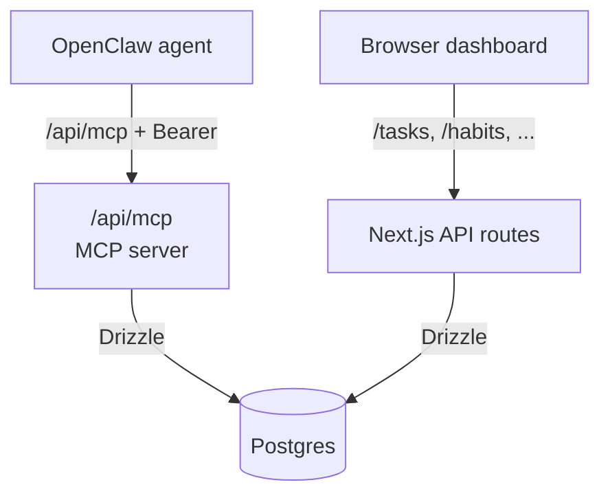

# Daily Agent MCP

**Self-hosted productivity data layer for [OpenClaw](https://openclaw.ai).**
Postgres behind a typed MCP interface, plus a Next.js dashboard that reads and edits the same database. Single-user, Tailscale-gated.

!!! info "Not a chatbot"
    This project is *not* an AI product. It's a durable store for tasks, habits, journal, workouts, focus sessions, goals, and spaces — exposed to your agent over MCP and to your browser over HTTP. All generative AI (briefings, reviews, insights) lives in OpenClaw.

---

## The shape of it

Two front doors, one database.

- **MCP server** (`/api/mcp`) — the agent's interface. 34 typed tools for reading and writing every piece of productivity data, 13 prompt templates, plus read-only resources. Bearer-token authenticated.
- **Dashboard** — a Next.js UI for browsing and manually editing the same data. No AI features. No generate buttons. Just CRUD.

OpenClaw owns model choice, scheduling, message delivery (Telegram / WhatsApp / etc.), briefings, insights, and reviews. This repo owns storage and the contract.

## Who this is for

You if:

- You're already running OpenClaw (or a similar agent) and want it to stop writing data into a pile of markdown templates and scripts.
- You want your productivity data in **one Postgres database** you control, not scattered across a dozen services.
- You're comfortable running Docker + Compose on a VPS and putting it behind Tailscale.
- You want a simple browser UI to poke at the data without opening a SQL shell.

## Where to go next

-   :material-rocket-launch:{ .lg .middle } **Quick start**

    ---

    Download `docker-compose.example.yml`, fill three env vars, `docker compose up -d`. Works on any Docker host.

    [:octicons-arrow-right-24: Install in 5 minutes](quick-start.md)

-   :material-update:{ .lg .middle } **Updating**

    ---

    `docker compose pull && docker compose up -d`. Migrations run automatically.

    [:octicons-arrow-right-24: See quick-start](quick-start.md#updating)

-   :material-server:{ .lg .middle } **Build from source**

    ---

    For contributors who want to build the image locally instead of pulling from GHCR.

    [:octicons-arrow-right-24: Deploy from source](DEPLOY.md)

-   :material-api:{ .lg .middle } **MCP reference**

    ---

    34 tools, grouped by domain, with input schemas and examples.

    [:octicons-arrow-right-24: Browse tools](mcp-reference.md)

-   :material-puzzle:{ .lg .middle } **OpenClaw integration**

    ---

    The skill file OpenClaw needs, plus usage patterns.

    [:octicons-arrow-right-24: Skill setup](openclaw-skill.md)

-   :material-sitemap:{ .lg .middle } **Architecture**

    ---

    Request flow, auth layers, data model, where validation happens.

    [:octicons-arrow-right-24: Under the hood](architecture.md)

-   :material-wrench:{ .lg .middle } **Troubleshooting**

    ---

    401s, connection refused, port conflicts, MCP schema errors.

    [:octicons-arrow-right-24: Fix it](troubleshooting.md)

## License

Apache 2.0. Modify and self-host freely.
